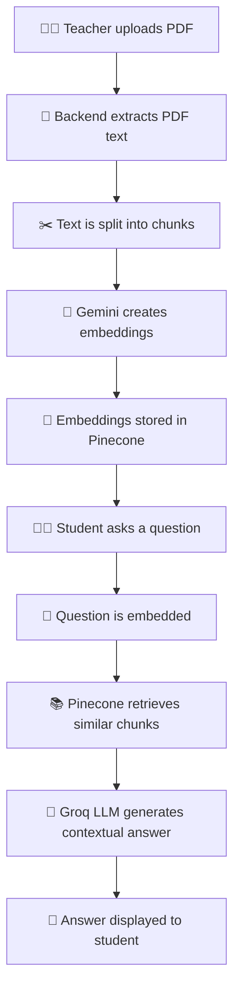
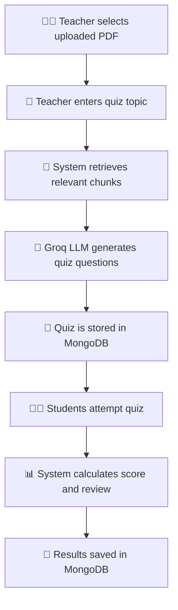

<div align="center">

# 🤖 AI Teaching Assistant

### 📚 AI-Powered Teaching, Learning & Quiz Generation Platform

A full-stack **RAG-based educational web application** that helps teachers upload study materials, generate AI-powered quizzes, and monitor student performance, while students can ask AI questions from PDF materials, attempt quizzes, and track their learning progress.

<br/>


</div>

---

## 📌 Project Overview

**AI Teaching Assistant** is a modern AI-powered learning platform designed to improve the teaching and learning experience using **Retrieval-Augmented Generation (RAG)**.

Teachers can upload PDF study materials, automatically extract and chunk document content, generate quizzes using AI, manage quizzes, and view student performance reports. Students can view uploaded study materials, ask AI-powered questions from selected PDFs, attempt quizzes, view explanations, and track their learning history.

This project combines **AI, full-stack web development, vector search, authentication, and cloud database integration** into one complete educational platform.

---

## ✨ Main Highlights

- 🧠 **RAG-based AI chat system** for answering questions from uploaded PDF content  
- 📄 **PDF upload, extraction, chunking, and preview** functionality  
- 🔎 **Vector search with Pinecone** for retrieving relevant study material chunks  
- 🔮 **Gemini embeddings** for semantic document search  
- ⚡ **Groq LLM integration** for AI answers and quiz generation  
- 📝 **AI-generated quizzes** based on teacher-selected study materials  
- 👨‍🏫 **Teacher dashboard** for managing documents, quizzes, and reports  
- 👨‍🎓 **Student dashboard** for learning, chatting, quizzes, and history  
- 🔐 **Google OAuth authentication** with role-based access  
- 🍃 **MongoDB Atlas** for storing users, documents, quizzes, chats, and results  
- 🚀 Deployment-ready setup for **Render + Vercel**

---

## 👥 User Roles

| Role | Main Responsibilities |
|---|---|
| 👨‍🏫 **Teacher** | Upload PDFs, generate quizzes, manage quizzes, view reports |
| 👨‍🎓 **Student** | View materials, ask AI questions, attempt quizzes, track results |

---

## 👨‍🏫 Teacher Features

- 🔐 Sign in using Google OAuth  
- 📄 Upload PDF study materials  
- 🧠 Automatically extract text from uploaded PDFs  
- ✂️ Split extracted content into meaningful chunks  
- 📌 Store document metadata and chunks in MongoDB  
- 🔎 Store vector embeddings in Pinecone  
- 👀 Preview extracted document chunks  
- 📝 Generate AI quizzes from selected uploaded documents  
- ✏️ Edit AI-generated quiz questions and answers  
- 🗑️ Delete quizzes when needed  
- 🗑️ Delete uploaded documents and related Pinecone vectors  
- 📊 View student quiz attempt reports  
- 📈 Track scores, percentages, and learning progress  

---

## 👨‍🎓 Student Features

- 🔐 Sign in using Google OAuth  
- 📚 View uploaded study materials  
- 👀 Preview extracted PDF chunks  
- 💬 Ask AI questions from a selected document  
- 🔎 Receive RAG-based answers using relevant PDF content  
- 📝 View available quizzes  
- ✅ Attempt quizzes  
- 🏆 View quiz results with score and percentage  
- ✅ Review correct and wrong answers  
- 💡 View explanations for answers  
- 📜 View AI chat history  
- 📊 View quiz attempt history and average score  

---

## 🧠 RAG Workflow



---

## 🧪 Quiz Generation Workflow



---

## 🛠️ Technologies Used

### 🎨 Frontend

| Technology | Purpose |
|---|---|
| ⚛️ **React** | Frontend UI development |
| ⚡ **Vite** | Fast React development environment |
| 🎨 **Tailwind CSS** | Modern responsive styling |
| 🔁 **React Router DOM** | Page routing and navigation |
| 🌐 **Axios** | API request handling |
| 🔐 **Google OAuth** | User authentication |
| 🎯 **Lucide React Icons** | Clean UI icons |

### 🚀 Backend

| Technology | Purpose |
|---|---|
| 🐍 **Python** | Backend programming language |
| 🚀 **FastAPI** | REST API backend framework |
| 🔐 **JWT Authentication** | Secure protected routes |
| 📄 **PDF Text Extraction** | Extracting study material content |
| 🧩 **Pydantic** | Data validation and schemas |
| 🌱 **Python Dotenv** | Environment variable management |
| 🌐 **Uvicorn** | ASGI server for FastAPI |

### 🗄️ Database & AI Services

| Service | Purpose |
|---|---|
| 🍃 **MongoDB Atlas** | Main cloud database |
| 📌 **Pinecone** | Vector database for RAG retrieval |
| 🔮 **Gemini Embeddings** | Text embedding generation |
| 🧠 **Groq LLM** | AI answer and quiz generation |
| 🔐 **Google OAuth Client** | Google login integration |

---

## 📁 Project Structure

```text
AI Teaching Assistant/
│
├── backend/
│   ├── app/
│   │   ├── auth/
│   │   │   ├── routes.py
│   │   │   ├── schemas.py
│   │   │   ├── service.py
│   │   │   └── dependencies.py
│   │   │
│   │   ├── chat/
│   │   │   ├── routes.py
│   │   │   └── schemas.py
│   │   │
│   │   ├── documents/
│   │   │   ├── routes.py
│   │   │   └── pdf_utils.py
│   │   │
│   │   ├── embeddings/
│   │   │   ├── gemini_service.py
│   │   │   └── pinecone_service.py
│   │   │
│   │   ├── llm/
│   │   │   └── groq_service.py
│   │   │
│   │   ├── quiz/
│   │   │   ├── routes.py
│   │   │   └── schemas.py
│   │   │
│   │   ├── database.py
│   │   └── main.py
│   │
│   ├── uploads/
│   ├── requirements.txt
│   └── .env
│
├── frontend/
│   ├── src/
│   │   ├── api/
│   │   │   └── axios.js
│   │   │
│   │   ├── pages/
│   │   │   ├── Login.jsx
│   │   │   ├── TeacherDashboard.jsx
│   │   │   ├── TeacherGenerateQuiz.jsx
│   │   │   ├── TeacherQuizzes.jsx
│   │   │   ├── TeacherEditQuiz.jsx
│   │   │   ├── TeacherReports.jsx
│   │   │   ├── StudentDashboard.jsx
│   │   │   ├── StudentChat.jsx
│   │   │   ├── StudentQuizzes.jsx
│   │   │   ├── StudentAttemptQuiz.jsx
│   │   │   ├── StudentQuizResult.jsx
│   │   │   ├── StudentHistory.jsx
│   │   │   └── StudyMaterials.jsx
│   │   │
│   │   ├── App.jsx
│   │   └── main.jsx
│   │
│   ├── package.json
│   └── .env
│
├── .gitignore
└── README.md
```

---

## 🔐 Authentication

The application uses **Google OAuth** for secure user authentication.

After logging in with Google, the user selects a role:

- 👨‍🏫 **Teacher**
- 👨‍🎓 **Student**

The backend validates the Google credentials and issues a **JWT token**. The token is stored in local storage and used for protected API requests.

---

## 🗄️ MongoDB Collections

| Collection | Purpose |
|---|---|
| 👤 `users` | Stores Google login users and selected roles |
| 📄 `documents` | Stores uploaded PDF metadata |
| ✂️ `document_chunks` | Stores extracted PDF text chunks |
| 💬 `chats` | Stores student AI chat history |
| 📝 `quizzes` | Stores AI-generated quizzes |
| 📊 `quiz_attempts` | Stores student quiz results and reviews |

---

## 📌 Main API Endpoints

### 🔐 Authentication

| Method | Endpoint | Description |
|---|---|---|
| `POST` | `/auth/google-login` | Login using Google OAuth |
| `GET` | `/auth/me` | Get logged-in user details |
| `GET` | `/auth/stats` | Get authentication/user statistics |

### 📄 Documents

| Method | Endpoint | Description |
|---|---|---|
| `POST` | `/documents/upload` | Upload PDF study material |
| `GET` | `/documents/` | Get all uploaded documents |
| `GET` | `/documents/{document_id}/preview` | Preview extracted document chunks |
| `DELETE` | `/documents/{document_id}` | Delete document and related vectors |

### 💬 Chat

| Method | Endpoint | Description |
|---|---|---|
| `POST` | `/chat/ask` | Ask AI a question from selected PDF |
| `GET` | `/chat/history` | Get student chat history |

### 📝 Quiz

| Method | Endpoint | Description |
|---|---|---|
| `POST` | `/quiz/generate` | Generate quiz from selected document |
| `GET` | `/quiz/` | Get all quizzes |
| `GET` | `/quiz/{quiz_id}` | Get selected quiz |
| `PUT` | `/quiz/{quiz_id}` | Update quiz |
| `DELETE` | `/quiz/{quiz_id}` | Delete quiz |
| `POST` | `/quiz/submit` | Submit quiz attempt |
| `GET` | `/quiz/attempts/history` | Get student quiz history |
| `GET` | `/quiz/attempts/all` | Get all quiz attempts for teacher reports |

### 🩺 Health Check

| Method | Endpoint | Description |
|---|---|---|
| `GET` | `/health` | Check backend health |
| `GET` | `/db-check` | Check MongoDB connection |

---

## ⚙️ Environment Variables

### 🐍 Backend `.env`

Create a `.env` file inside the `backend` folder.

```env
GOOGLE_CLIENT_ID=your_google_client_id
JWT_SECRET_KEY=your_jwt_secret_key
JWT_ALGORITHM=HS256

GEMINI_API_KEY=your_gemini_api_key

PINECONE_API_KEY=your_pinecone_api_key
PINECONE_INDEX_NAME=ai-teaching-assistant
PINECONE_NAMESPACE=study-materials
EMBEDDING_MODEL=gemini-embedding-2
EMBEDDING_DIMENSION=768

GROQ_API_KEY=your_groq_api_key
GROQ_MODEL=llama-3.3-70b-versatile

MONGODB_URI=your_mongodb_connection_string
MONGODB_DB_NAME=ai_teaching_assistant
```

### ⚛️ Frontend `.env`

Create a `.env` file inside the `frontend` folder.

```env
VITE_GOOGLE_CLIENT_ID=your_google_client_id
VITE_API_BASE_URL=http://127.0.0.1:8000
```

For deployment, replace the local backend URL with your deployed backend URL.

```env
VITE_API_BASE_URL=https://your-backend-url.onrender.com
```

---

## 🚀 How to Run Locally

### 1️⃣ Clone the Repository

```bash
git clone https://github.com/your-username/AI-Teaching-Assistant.git
cd AI-Teaching-Assistant
```

---

### 2️⃣ Backend Setup

Go to the backend folder:

```bash
cd backend
```

Create a virtual environment:

```bash
python -m venv venv
```

Activate the virtual environment:

#### Windows PowerShell

```powershell
.\venv\Scripts\Activate.ps1
```

#### Windows CMD

```cmd
venv\Scripts\activate
```

Install dependencies:

```bash
pip install -r requirements.txt
```

Run the backend:

```bash
python -m uvicorn app.main:app --reload
```

Backend URL:

```text
http://127.0.0.1:8000
```

Swagger API documentation:

```text
http://127.0.0.1:8000/docs
```

---

### 3️⃣ Frontend Setup

Open a new terminal and go to the frontend folder:

```bash
cd frontend
```

Install dependencies:

```bash
npm install
```

Run the frontend:

```bash
npm run dev
```

Frontend URL:

```text
http://localhost:5173
```

---

## 🧪 Testing Flow

### 👨‍🏫 Teacher Flow

1. 🔐 Login as a teacher  
2. 📄 Upload PDF study material  
3. 👀 Preview extracted document chunks  
4. 📝 Generate a quiz from a selected document  
5. ✏️ Manage generated quizzes  
6. 🧩 Edit quiz questions and answers  
7. 🗑️ Delete quizzes when needed  
8. 📊 View student performance reports  

### 👨‍🎓 Student Flow

1. 🔐 Login as a student  
2. 📚 View study materials  
3. 👀 Preview uploaded PDF chunks  
4. 💬 Ask AI questions from selected PDF  
5. 📝 View available quizzes  
6. ✅ Attempt quizzes  
7. 🏆 View score and explanations  
8. 📜 View learning history  

---

## 🌐 Deployment Guide

This project can be deployed using free-tier cloud platforms.

| Part | Recommended Platform |
|---|---|
| 🚀 Backend | Render |
| 🌍 Frontend | Vercel |
| 🍃 Database | MongoDB Atlas |
| 📌 Vector Database | Pinecone |
| 🧠 AI Services | Gemini + Groq |

---

## 🚀 Backend Deployment on Render

Use these Render settings:

| Setting | Value |
|---|---|
| Language | Python |
| Root Directory | `backend` |
| Build Command | `pip install -r requirements.txt` |
| Start Command | `python -m uvicorn app.main:app --host 0.0.0.0 --port $PORT` |
| Health Check Path | `/health` |
| Instance Type | Free |

Add all backend `.env` values as Render environment variables.

After deployment, test these URLs:

```text
https://your-backend-url.onrender.com/
https://your-backend-url.onrender.com/health
https://your-backend-url.onrender.com/db-check
```

---

## 🌍 Frontend Deployment on Vercel

Use these Vercel settings:

| Setting | Value |
|---|---|
| Framework Preset | Vite |
| Root Directory | `frontend` |
| Build Command | `npm run build` |
| Output Directory | `dist` |
| Install Command | `npm install` |

Add frontend environment variables:

```env
VITE_GOOGLE_CLIENT_ID=your_google_client_id
VITE_API_BASE_URL=https://your-backend-url.onrender.com
```

---

## 🔐 Google OAuth Deployment Setup

In **Google Cloud Console**, add these under **Authorized JavaScript Origins**:

```text
http://localhost:5173
https://your-frontend-url.vercel.app
```

---

## 🌍 MongoDB Network Access

For local development, allow your current IP address in MongoDB Atlas.

For Render deployment on the free tier, you may need to allow:

```text
0.0.0.0/0
```

> ⚠️ Use a strong MongoDB password when allowing access from anywhere.

---

## ⚠️ Free Tier Limitations

When using free services, keep these limitations in mind:

- 💤 Render backend may sleep after inactivity  
- 🐢 First request after sleep may be slow  
- 📁 Render free filesystem is not permanent  
- 📄 Large PDF uploads may take longer  
- 📊 API providers may have usage limits  
- 🍃 MongoDB, Pinecone, Gemini, and Groq may have free-tier limits  

The system stores important extracted text in MongoDB and embeddings in Pinecone, so uploaded PDF content can still be used through saved chunks and vectors.

---

## 🔒 Security Notes

> 🚨 Never commit `.env` files or secret keys to GitHub.

Recommended `.gitignore`:

```gitignore
# Python
backend/venv/
__pycache__/
*.pyc
*.pyo
*.pyd

# Environment files
.env
backend/.env
frontend/.env

# Node
frontend/node_modules/
frontend/dist/

# Uploaded files
backend/uploads/

# VS Code
.vscode/

# System files
.DS_Store
Thumbs.db
```

If an API key, password, or secret is accidentally exposed, regenerate it immediately.

---

## 🎯 Project Purpose

This project was developed to demonstrate how **AI, RAG, vector databases, full-stack development, and cloud services** can be combined to build a practical educational platform that supports both teachers and students.

---

## 👨‍💻 Developer

**AI Teaching Assistant**  
Built with ❤️ using **React, FastAPI, MongoDB, Pinecone, Gemini, and Groq**.

---

<div align="center">

### ⭐ If you like this project, consider giving it a star!

</div>


